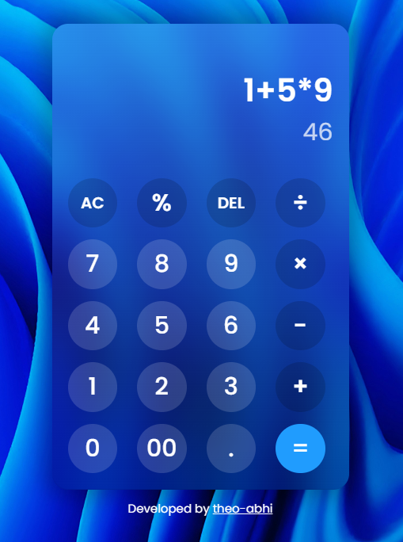

# Basic-Calculator-HTML-CSS-JS

# Basic-Calculator-App-HTML-CSS-JS

A simple and functional calculator app built using **HTML**, **CSS**, and **JavaScript**. This project is designed to demonstrate basic front-end skills, including DOM manipulation, styling, and handling user inputs.

## 🚀 Features

- Basic arithmetic operations: **Addition**, **Subtraction**, **Multiplication**, **Division**
- Clear and backspace functions
- Real-time input and result display
- Keyboard support (optional)
- Responsive and intuitive UI design

## 🖼️ Preview



## 🛠️ Tech Stack

- **HTML5** – Structure of the calculator
- **CSS3** – Styling and responsive layout
- **JavaScript (ES6)** – Core calculator logic and interactivity

## 📁 Project Structure

Basic-Calculator-App-HTML-CSS-JS/
├── index.html
├── style.css
├── script.js
└── README.md

## 🧠 How It Works

1. User inputs numbers and operators via buttons.
2. Display updates in real time to reflect current input.
3. Pressing `=` computes and displays the result.
4. The `AC` button clears the input and result.
5. The `DEL` button lets you delete the last digit or operator.

## 📦 Getting Started

1. Clone the repository:

```bash
git clone https://github.com/your-username/Basic-Calculator-App-HTML-CSS-JS.git

2. Open index.html in your web browser.

No build tools or external dependencies required.

✨ Future Improvements

1. Add keyboard input support

2. Support decimal and negative numbers more robustly

3. Add history of calculations

4. Improve layout for very small screens

5.Implement scientific calculator features (square root, power, etc.)

```
